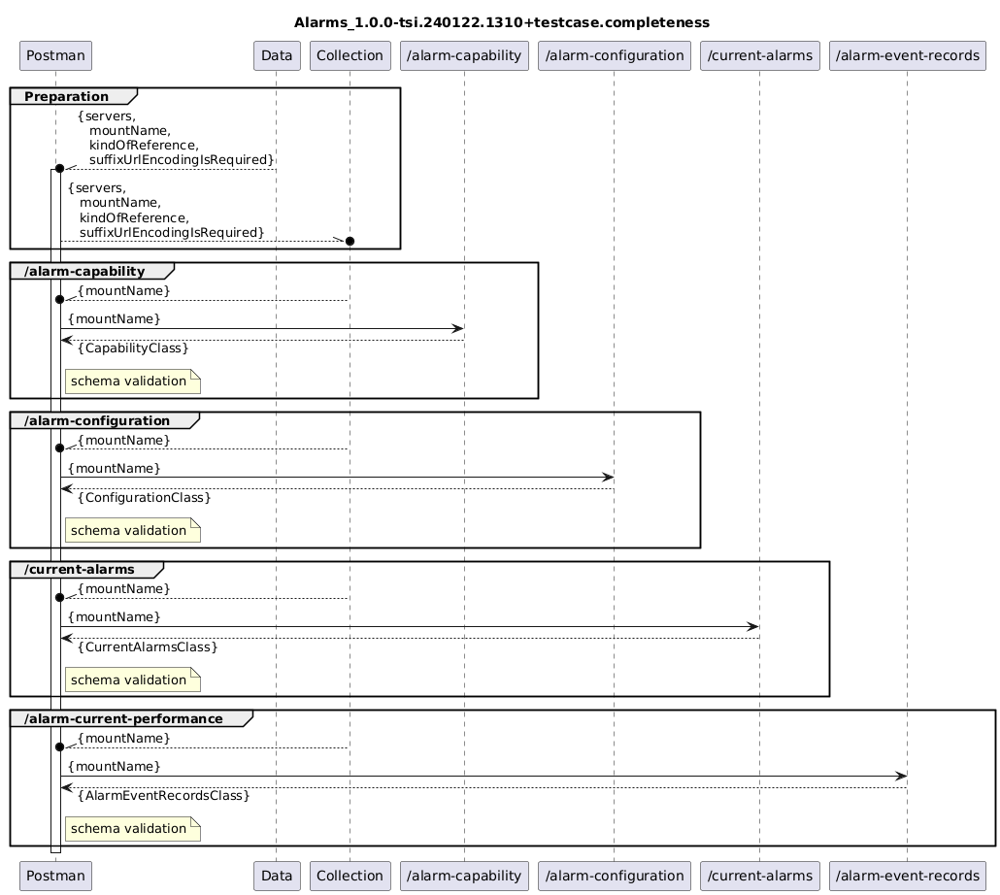

# Alarms_1.0.0-tsi.240122.1310+validator

### Completeness
- [Alarms_1.0.0-tsi.240122.1310+validator.completeness](./Completeness/Alarms_1.0.0-tsi.240122.1310+validator.completeness.json)  
- [Alarms_1.0.0-tsi.240122.1310+data.completeness](./Completeness/Alarms_1.0.0-tsi.240122.1310+data.completeness.json)  
-   
